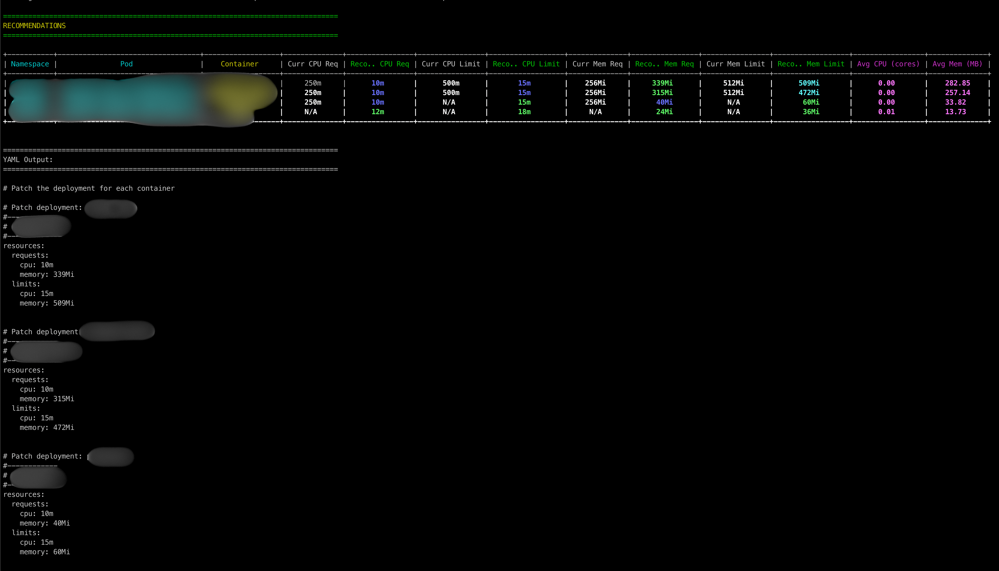
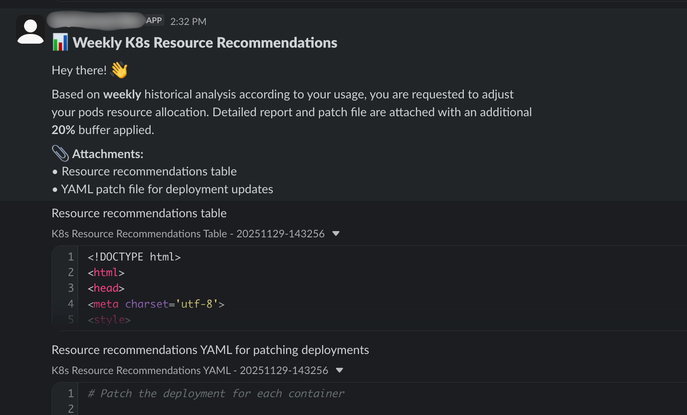
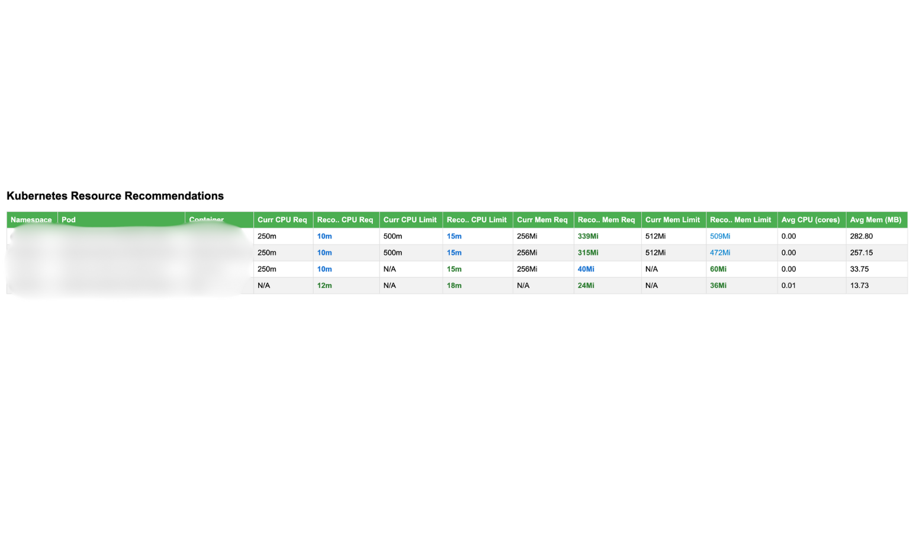

# K8s Resource Optimizer

Automated Kubernetes resource recommendation tool that analyzes historical Prometheus metrics to generate right-sized CPU and memory recommendations for your deployments.

## The Problem

Managing resource allocation for hundreds of Kubernetes pods across multiple namespaces is challenging. Over-provisioning leads to wasted cloud costs, while under-provisioning risks application performance. When faced with analyzing and optimizing around 400 pods based on actual usage patterns, manual analysis becomes impractical and time-consuming.

## The Solution

This tool was created to automate the process of analyzing pod resource usage and generating data-driven recommendations. It integrates with Prometheus to analyze historical metrics, calculates optimal resource requests and limits based on statistical analysis (mean for requests, P95 for limits), and provides actionable recommendations through multiple output formats.

## How It Works

The tool runs as a Kubernetes CronJob, deployed via Helm chart, that:

1. Connects to Prometheus to retrieve historical CPU and memory metrics for all running pods
2. Analyzes usage patterns over a configurable time period (default: 7 days)
3. Calculates recommendations using statistical analysis with configurable safety buffers
4. Generates YAML patches ready for deployment updates
5. Sends reports to Slack with detailed HTML tables and patch files

## Key Features

- Historical Analysis: Analyzes configurable time periods (default 7 days) of Prometheus metrics
- Statistical Recommendations: Uses mean values for requests and P95 percentiles for limits
- Multiple Output Formats: Generates both human-readable tables and machine-readable YAML patches
- Slack Integration: Automated reports with HTML-formatted tables and downloadable patch files
- Safety Buffers: Configurable buffer percentage to add headroom to recommendations

## Installation

### Prerequisites

- Kubernetes cluster
- Prometheus with `container_cpu_usage_seconds_total` and `container_memory_working_set_bytes` metrics

### Deploy via Helm

1. Clone the repository:
```bash
git clone git@github.com:umairedu/kube-rightsizer.git
cd kube-rightsizer
```

2. Configure environment variables in `helm/resource-right-sizing/production/values.yaml`:
```yaml
resource_sizing:
  plain:
    PROMETHEUS_URL: "http://prometheus-server.default.svc:9090"
    KUBERNETES_USE_IN_CLUSTER_CONFIG: "true"
    TARGET_NAMESPACE: ""  # Empty for all namespaces, or comma-separated list
    EXCLUDED_NAMESPACES: "kube-system"
    HOURS: "168"  # 7 days
    BUFFER_PERCENT: "20"
    OUTPUT_FORMAT: "both"
  
  secrets:
    SLACK_TOKEN: "your-slack-token"
    SLACK_CHANNEL: "your-channel"
    SLACK_VERIFY_SSL: "true"
```

3. Deploy the Helm chart:
```bash
helm install resource-right-sizing ./helm/resource-right-sizing \
  -f ./helm/resource-right-sizing/production/values.yaml \
  -n <your-namespace>
```

### Local Development

1. Install dependencies:
```bash
pip install -r requirements.txt
```

2. Configure environment variables (copy `env.sample` to `.env` and update):
```bash
cp env.sample .env
# Edit .env with your configuration
```

3. Run locally:
```bash
python3 main.py
```

## Configuration

All configuration is done via environment variables:

- `PROMETHEUS_URL`: Prometheus server URL
- `KUBERNETES_USE_IN_CLUSTER_CONFIG`: Use in-cluster config (true/false)
- `TARGET_NAMESPACE`: Comma-separated list of namespaces to scan (empty for all)
- `EXCLUDED_NAMESPACES`: Comma-separated list of namespaces to exclude
- `HOURS`: Number of hours of historical data to analyze
- `BUFFER_PERCENT`: Safety buffer percentage to add to recommendations
- `OUTPUT_FORMAT`: Output format (table, yaml, or both)
- `SLACK_TOKEN`: Slack bot token for notifications
- `SLACK_CHANNEL`: Slack channel for notifications
- `SLACK_VERIFY_SSL`: SSL verification for Slack API (true/false)

## Example Output

### CLI Output

The tool provides color-coded terminal output showing current vs recommended resources:



### Slack Notifications

Weekly reports are sent to Slack with HTML-formatted tables and downloadable YAML patch files:



## Project Structure

```
kube-rightsizer/
├── main.py                 # Main application entry point
├── config.py              # Configuration management (Pydantic)
├── services/
│   ├── kubernetes.py      # Kubernetes API interactions
│   ├── prometheus.py      # Prometheus metrics queries
│   └── slack.py           # Slack notification integration
├── helm/
│   └── resource-right-sizing/
│       ├── Chart.yaml
│       ├── production/
│       │   └── values.yaml
│       └── templates/
│           ├── cron_job.yaml
│           ├── rbac.yaml
│           └── secrets.yaml
├── Dockerfile
├── requirements.txt
└── env.sample
```